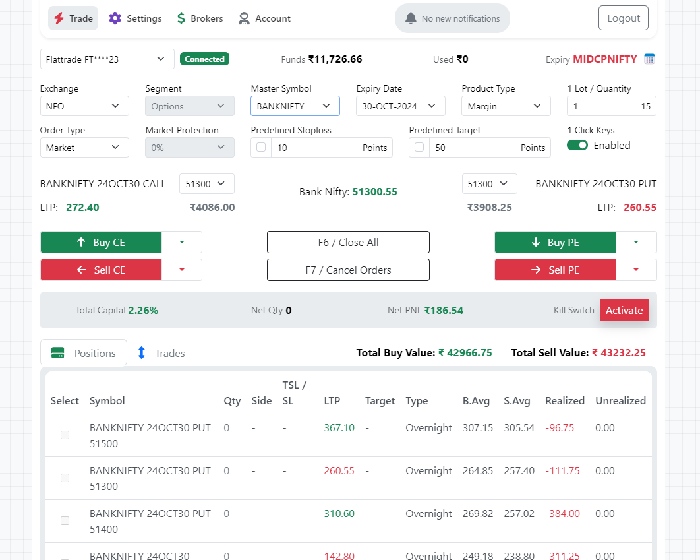
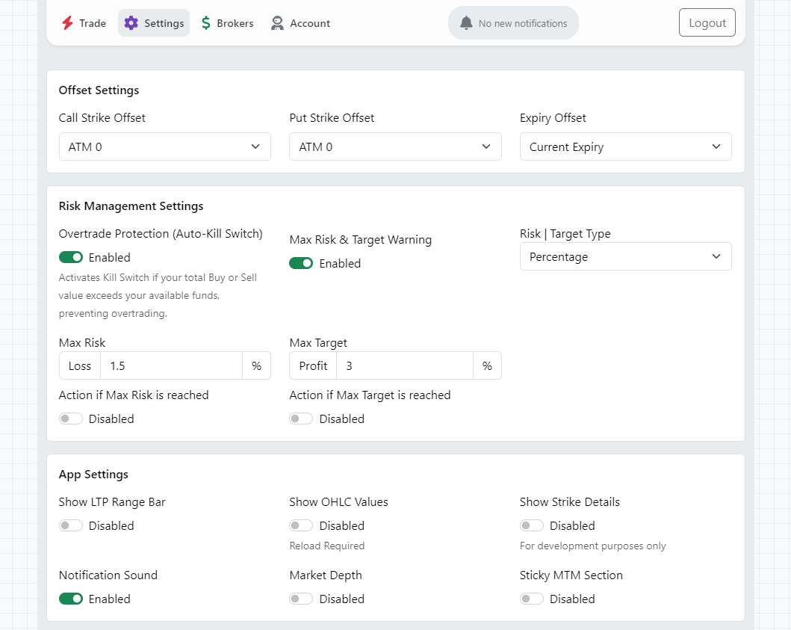
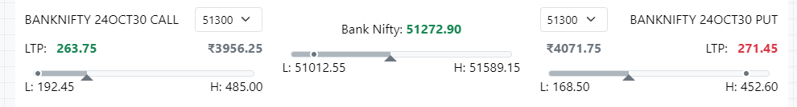
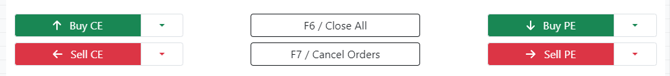
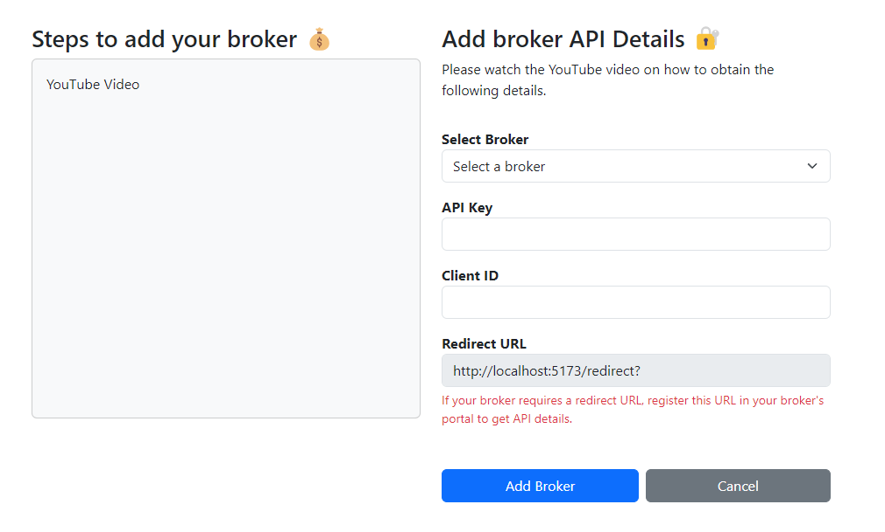
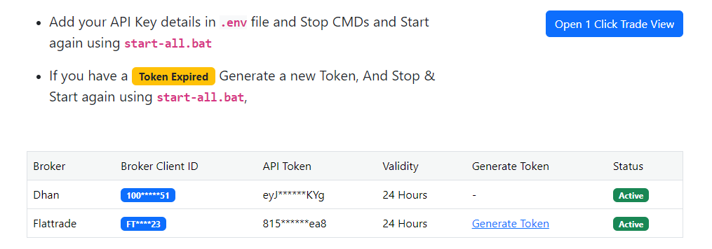

#### There are two different versions for this project.
### ⚠️ Important Notice for `Open Source Version` 
**This repository contains experimental, AI-generated code - USE WITH CAUTION**
- This codebase is intended primarily for learning and experimental purposes
- Contains potential bugs, security vulnerabilities, and implementation issues
- Code quality is experimental-grade and not optimized for production
- Can be used for real trading, but with extreme caution and at your own risk
- May be unstable and prone to errors
- Users should thoroughly test and understand the code before using with real funds

### 🚀 Looking for a web access? `Premium Version` 
#### A professionally developed web application is available at [steadfastapp.in](https://steadfastapp.in), built using `TypeScript` and highly optimized for lightning-fast trades.

# Project Overview

This repository is a monorepo containing three main projects:

1. [**steadfast-app**](https://github.com/narenkram/steadfast-app): The frontend application.
2. [**steadfast-api**](https://github.com/narenkram/steadfast-api): The backend API server.
3. [**steadfast-websocket**](https://github.com/narenkram/steadfast-websocket): The WebSocket service.

### Quick Status

For the most up-to-date status of features and implementations, please refer to our [Status Page](status.md).

# App Screenshots

## Light Mode



## Dark Mode


## App Settings



## LTP Range Bar



## One Click Trading Keys



## Add Broker



## Manage Brokers



# Join Our Telegram Channel

Stay updated by joining our [Telegram Channel](https://t.me/steadfastapp).

# ⚡ Steps to run the app

### `Step 0`: Prerequisites

Operating System: `Windows 11`

1. Ensure [Git](https://git-scm.com/download/win) is installed and accessible from the command line.

```
git --version
```

2. Ensure [Node.js v20.18.0 and npm v10.8.2](https://nodejs.org/en/download/prebuilt-installer) are installed and accessible from the command line.

```
node -v && npm -v
```

3. Ensure [Python 3.12](https://www.python.org/downloads/) is installed and accessible from the command line.

```
python -V
```

### `Step 1`: Clone the Steadfast Monorepo

1. Open your terminal or command prompt.
2. Run the following command:

```bash
git clone https://github.com/narenkram/steadfast-monorepo
```

3. This will create a new folder named "steadfast-monorepo" in your current directory.
4. Open/Navigate the monorepo folder in file explorer.

### `Step 2`: Start

Double-click the `start-all.bat` file or run it from the command prompt.

#### What it does:

1. **Install all (Recommended for first time setup):** Clones the repositories and installs dependencies.
2. **Update, install and run (Recommended when a update is available):** Updates all repositories, installs dependencies, and then runs the services.
3. **Run existing version:** Runs the existing version of the services without updating or installing anything.
4. **Exit:** Exits the script.

#### What it does:

1. Starts the steadfast-app at `localhost: 5173`
2. Starts the steadfast-api server at `localhost: 3000`
3. Starts the flattrade-websocket server at `localhost: 8765`
4. Starts the shoonya-websocket server at `localhost: 8766`

### `Step 3`: Stop

- To `Stop` simply close the opened command prompt windows.
- Or Press any key to stop the app, api and websocket.

