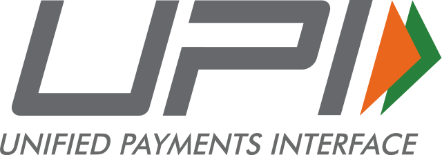

# Project Overview

This repository is a monorepo containing three main projects:

1. [**steadfast-app**](https://github.com/narenkram/steadfast-app): The frontend application.
2. [**steadfast-api**](https://github.com/narenkram/steadfast-api): The backend API server.
3. [**steadfast-websocket**](https://github.com/narenkram/steadfast-websocket): The WebSocket service.

### Quick Status (Updated: 03-10-2024)

Legend:
🟢 Available/Implemented
🟡 In Progress
🔵 Planned
⚡ Requested by our users
🔴 Not Currently Considered

| Feature                                        | Status |
| ---------------------------------------------- | ------ |
| **Supported Brokers**                          |        |
| Flattrade                                      | 🟢     |
| Shoonya (Finvasia)                             | 🟢     |
| ⚡ Other Brokers                               | 🔴     |
| **Trading Operations**                         |        |
| Place Buy/Sell at market/limit orders          | 🟢     |
| Cancel orders                                  | 🟢     |
| Cancel selected orders                         | 🔵     |
| Close all positions                            | 🟢     |
| Close selected positions                       | 🟢     |
| Select strikes                                 | 🟢     |
| Modify open/pending order                      | 🔵     |
| **Basic Features**                             |        |
| Automatic ATM strike selection                 | 🟢     |
| Selection Offsets                              | 🟢     |
| Live MTM / PNL by Amount & ROI Percentage      | 🟢     |
| Target & Stoploss by Percentage/Amount         | 🟢     |
| Trailing Stoploss                              | 🟢     |
| ⚡Underlying & Futures based Target & Stoploss | 🔵     |
| Basket Orders                                  | 🟢     |
| Ready Made Strategies                          | 🟡     |
| **Key Features**                               |        |
| One-click trading buttons                      | 🟢     |
| Kill switch (client-side)                      | 🟢     |
| Overtrade Protection                           | 🟢     |
| Trade Journal                                  | 🔵     |
| Paper Trading                                  | 🟡     |
| Reports For IT Filing                          | 🔵     |
| **Real-Time Market Data**                      |
| LTP for underlying                             | 🟢     |
| LTP for selected call/put strikes              | 🟢     |
| LTP Range Bar                                  | 🟢     |

#### Note:

- kill switch works on client side only, you will still be able to trade from your broker terminal.
- All these symbols can be traded: NIFTY, BANKNIFTY, FINIFTY, MIDCPNIFTY, SENSEX, and BANKEX.

# App Screenshots

## Light Mode


## Dark Mode


## App Settings


## LTP Range Bar


## One Click Trading Keys


## Add Broker


## Manage Brokers


# Join Our Telegram Channel

Stay updated by joining our [Telegram Channel](https://t.me/steadfastapp).

# ⚡ Steps to run the app

### `Step 0`: Prerequisites

Operating System: `Windows 11`

1. Ensure [Git](https://git-scm.com/download/win) is installed and accessible from the command line.

```
git --version
```

2. Ensure [Node.js v21.7.3 and npm v10.5.0](https://nodejs.org/en/download/prebuilt-installer) are installed and accessible from the command line.

```
node -v && npm -v
```

3. Ensure [Python 3.12](https://www.python.org/downloads/) is installed and accessible from the command line.

```
python -V
```

### `Step 1`: Clone the Steadfast Monorepo

1. Open your terminal or command prompt.
2. Run the following command:

```bash
git clone https://github.com/narenkram/steadfast-monorepo
```

3. This will create a new folder named "steadfast-monorepo" in your current directory.
4. Open/Navigate the monorepo folder in file explorer.

### `Step 2`: Start

Double-click the `start-all.bat` file or run it from the command prompt.

#### What it does:

1. **Install all (Recommended for first time setup):** Clones the repositories and installs dependencies.
2. **Update, install and run (Recommended when a update is available):** Updates all repositories, installs dependencies, and then runs the services.
3. **Run existing version:** Runs the existing version of the services without updating or installing anything.
4. **Exit:** Exits the script.

#### What it does:

1. Starts the steadfast-app at `localhost: 5173`
2. Starts the steadfast-api server at `localhost: 3000`
3. Starts the flattrade-websocket server at `localhost: 8765`
4. Starts the shoonya-websocket server at `localhost: 8766`

### `Step 3`: Stop

- To `Stop` simply close the opened command prompt windows.
- Or Press any key to stop the app, api and websocket.

# 📜 License

This project is licensed under a Custom Free Use, No Commercialization License. It allows free use for personal and non-commercial purposes. Commercial use is possible but requires explicit permission and a revenue-sharing agreement with the project creator. For full license terms, please see the [LICENSE](LICENSE) file in this repository.

# 🤝 Contributing

Contributions are welcome! If you find any issues or want to add enhancements, feel free to submit a pull request. By contributing to this project, you agree that your contributions will be licensed under the same license terms as the project.

# 💼 Project Acquisition

This project is available for acquisition for 15 Lakhs (₹15,00,000) INR. The sale includes:

- Full ownership and all rights to the project
- The ability to make the project closed-source
- Complete freedom for any kind of commercialization
- Transfer of all associated repositories and assets

Upon completion of the sale, the current creator will step away from the project entirely.

Interested parties can contact email@narenkram.com for serious inquiries.

# ☕ Donate

If you find this project useful, consider showing your support! Your donations help maintain and improve the project. 😄

You can donate using UPI (Unified Payments Interface):



Scan the QR code below to make a UPI payment:


Thank you for your support!
